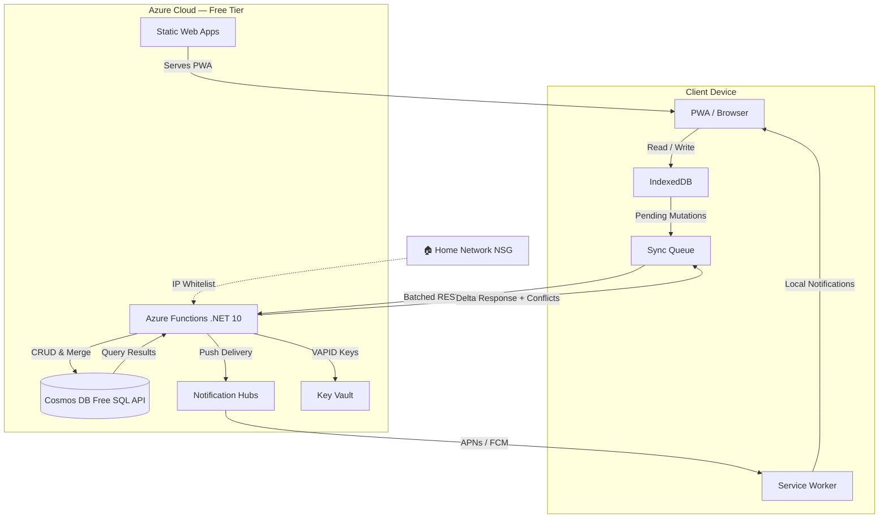

# 📝 Project: TaskVault
A self-hosted, offline-first todo list application that syncs to Azure on reconnect. Designed for personal use with a **$0/mo footprint**, accessible via browser or iOS PWA, and built for future multi-user expansion.

---

## 🎯 Idea & Vision
- **Core Concept**: A todo app that lives locally first, syncs securely to the cloud only when online.
- **Personal Focus**: Optimized for a single user today, but architected to scale to multi-user sharing later.
- **Network Isolation**: Configured to be accessible only from your homeserver network (IP whitelisting + Azure NSG).
- **Open Source**: Clean, documented, and ready for community extensions or forks.

---

## 🏗️ Architecture Overview

**Flow Summary**:
1. User creates/edits tasks → stored locally in IndexedDB.
2. Mutations are queued with client timestamps & sequence IDs.
3. On network return, queue batches to Azure Functions via REST.
4. Functions validate, merge, and persist to Cosmos DB Free SQL API.
5. Server returns delta state for conflict resolution.
6. Entire pipeline is gated behind your home IP via Azure NSG rules.

---

## ☁️ Azure Free Tier Compatibility
| Resource | Free Tier Limit | Project Usage | Safety Margin |
|----------|----------------|---------------|---------------|
| **Azure Functions** (Consumption F0) | 1M invocations/mo, 200k GB-sec/mo | Sync endpoints, push scheduler, validation | ~95% unused (sync is batched & sporadic) |
| **Cosmos DB Free SQL API** | 25 GB storage, 1000 RU/s provisioned | JSON task documents (single-user MVP) | ~0.1% storage, minimal RUs |
| **NSG (Network Security Group)** | Free (included with VNet) | Restrict functions & DB to home IP range | Exact match |
| **Static Web Apps** (Free F0) | 100 GB bandwidth/mo, 2 custom domains, free SSL | Host PWA frontend with global CDN | Well within limits for single-user |
| **Notification Hubs** (Free) | 1M pushes/mo, 500 active devices | Abstract push delivery across APNs + FCM | ~99% unused at single-user scale |
| **Key Vault** (Free tier) | 10K transactions/mo | Store VAPID keys, Cosmos connection strings | Minimal transaction count |
| **Application Insights** (Free tier) | 5 GB ingestion/mo | Logging & diagnostics for Functions + sync | Tiny volume for single-user |

**Total Cost**: `$0/mo` (assuming standard personal sync frequency & staying within limits).

---

## 📱 Mobile & Browser Access (No App Store Required)
- **iOS**: Deploy as a **Progressive Web App (PWA)**. Users open the URL in **Safari** → tap Share → `Add to Home Screen`. Behaves like a native app (Chrome on iOS does not support PWA install).
- **Android/Chrome**: Same PWA flow via Chrome + optional install prompt.

---

## 🔌 Offline-First Strategy

### What works fully offline
- **Task CRUD**: All creates, edits, deletions, and reads go to IndexedDB first — no network required.
- **Local Storage**: `IndexedDB` (via `Dexie.js` or `rxdb`) is the source of truth on-device.
- **Sync Queue**: Mutations are timestamped + sequence-numbered locally. Queued until connectivity returns.
- **Overdue Notifications**: On every app open, the service worker queries IndexedDB for tasks past their due date and fires local notifications via the Notifications API. No server needed.

### What requires connectivity
- **Cloud Sync**: Queued mutations batch to Azure Functions when online. Idempotent (operation IDs ensure safe retries).
- **Scheduled Push Reminders**: Server-initiated — Azure Functions timer polls Cosmos and pushes via Notification Hubs. If offline, pushes are held by APNs/FCM with a configurable TTL (delivered when the device reconnects).
- **Conflict Resolution**: MVP uses `last-write-wins` (trivial for single-user). Future: CRDT-ready structure for multi-user merge.

### Offline-first boundaries
| Feature | Offline | Online |
|---------|---------|--------|
| Create / edit / delete tasks | ✅ IndexedDB | ✅ Synced to Cosmos |
| View tasks & history | ✅ IndexedDB | ✅ IndexedDB (canonical) |
| Overdue reminders | ✅ Local notification on app open | ✅ Local + server push |
| Scheduled push reminders | ❌ Server-initiated only | ✅ Via Notification Hubs |
| Cross-device sync | ❌ Queued | ✅ Delta sync via Functions |

- **Free Tier Impact**: Sync only fires on network return or manual trigger. Azure Functions invoke count stays well below 1% of monthly limit.

---

## 🔔 Notifications & Reminders

### Online — Server Push
- **Web Push (VAPID)**: Azure Functions timer trigger polls Cosmos for upcoming due dates → pushes via Notification Hubs to APNs (iOS) and FCM (Android/Chrome).
- **iOS (16.4+)**: Web Push works **only** for PWAs installed to the Home Screen via Safari. Uses standard W3C Push API — same VAPID keys work cross-platform.
- **Push TTL**: If the device is offline when a push fires, APNs/FCM hold the message and deliver it when the device reconnects (configurable TTL per notification).

### Offline — Local Fallback
- **On App Open**: Service worker scans IndexedDB for overdue/upcoming tasks and fires local notifications via the Notifications API. No server round-trip.
- **No Background Wake on iOS**: Periodic Background Sync API is **not supported in Safari**. The app cannot wake itself on a schedule. Overdue checks only run when the user opens the app.
- **Android/Chrome**: Periodic Background Sync is available as a progressive enhancement — can check IndexedDB on a browser-defined interval even when the app is closed.

### iOS Reminder Workaround — Calendar Export
- **`.ics` Export**: Tasks with due dates can be exported as calendar events (single or bulk). iOS Calendar handles native scheduled notifications independently — **works offline, wakes the device, no PWA limitations**.
- **Subscribe URL** (optional): Serve a `.ics` feed from Azure Functions that iOS Calendar polls periodically. New/updated tasks with due dates appear automatically.
- **User Flow**: Task detail → "Add to Calendar" button → downloads `.ics` → iOS prompts to add to Calendar app → native reminder fires at due time.

---

## 👥 Multi-User Roadmap (Future)
- **Current**: Single-user DB partition/container. No auth layer beyond IP whitelist.
- **Architecture Ready For**: 
  - Tenant isolation (`userId` in all queries)
  - RBAC in Functions (owner vs read-only)
  - Shared sync containers with user-scoped conflict resolution
  - Optional: Azure SignalR (free tier: 20 connections, 20K msgs/day — sufficient for MVP) for real-time sync, or fallback to polling/delta sync
- **MVP Scope**: Single-user CRUD + local-first sync. Multi-user added in `v2` without breaking API contract.

---

## 🛠️ Tech Stack
| Layer | Technology |
|-------|------------|
| **Backend** | `.NET 10`, Azure Functions (Consumption), REST API |
| **Database** | Cosmos DB Free SQL API (JSON document model) |
| **Frontend** | Angular + `@angular/pwa` + `@angular/service-worker` |
| **Offline Storage** | IndexedDB via `Dexie.js` |
| **Push** | `SwPush` (Angular) → Notification Hubs → APNs / FCM |
| **Calendar Export** | `ics` npm package (`.ics` generation for iOS/Proton Calendar fallback) |
| **Sync Protocol** | REST with delta payloads, timestamp/sequence-based merge |
| **Security** | IP whitelisting, Azure NSG, Azure Key Vault (secrets), HTTPS via Functions App |
| **Hosting** | Azure Static Web Apps (Free F0) with global CDN + custom domain |

*Note*: While the backend is C#, the frontend uses Angular for PWA scaffolding, service worker management, and push registration. Blazor WebAssembly is an alternative if you prefer a full-C# stack.

---

## 📄 License & Open Source Ready
- Intended for `MIT` or `Apache 2.0` licensing
- Structured for clean separation: `/api`, `/workers`, `/db`, `/docs`, `/frontend`
- API contract documented in OpenAPI/Swagger spec (future step)
- CI/CD ready: GitHub Actions → Azure Functions + Cosmos DB (free tier compatible)

---
